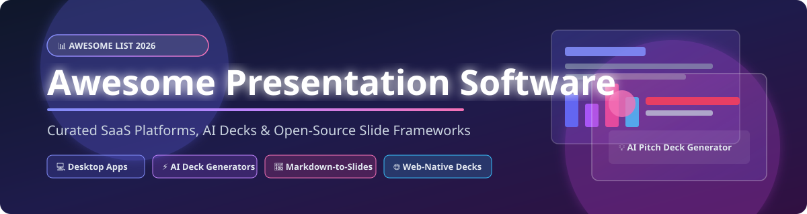

# Awesome Presentation Software 📊✨

  
  
  
  

> A curated list of **Presentation Software**, **AI Pitch Deck Generators**, **Web-Native Slide Frameworks**, and **Open-Source PowerPoint Alternatives**.

---

## 📖 Table of Contents

- [💡 Market Overview & Insights](#-market-overview--insights)
- [🏢 SaaS & Commercial Hosted Platforms](#-saas--commercial-hosted-platforms)
- [💻 Open-Source GitHub Projects](#-open-source-github-projects)
- [🤝 How to Contribute](#-how-to-contribute)
- [⚠️ Disclaimer](#%EF%B8%8F-disclaimer)
- [❤️ Support & Sponsorship](#%EF%B8%8F-support--sponsorship)
- [📈 Star History](#-star-history)

---

## 💡 Market Overview & Insights

The global **Presentation Software Market** is estimated at **~$11.5 Billion (2026)** with a projected CAGR of **~12.4%**. 

The sector is **moderately concentrated** at the traditional enterprise tier (dominated by Microsoft PowerPoint & Google Workspace), but **highly fragmented** across innovative niches such as design-first platforms (Canva), AI deck generators (Gamma, Beautiful.ai), and developer-centric Markdown presentation engines (reveal.js, Slidev, Marp).

---

## 🏢 SaaS & Commercial Hosted Platforms

> Sorted descending by company valuation, market capitalization, or annual revenue.

| Product / Platform | Description & Key Strengths | Starting Paid Price | Free Tier / Trial Details | Company Size (Valuation / Revenue / Market Cap) |
| :--- | :--- | :--- | :--- | :--- |
|  **[Apple Keynote](https://www.apple.com/keynote/)** | Apple's flagship presentation editor featuring cinematic transitions, Apple Pencil support, and elegant templates. | **$0.00** (Included free with Apple hardware) | 100% Free for all Apple ID account holders with 5 GB iCloud storage | **~$3.4 Trillion** (Apple Market Cap / $385B+ Revenue) |
| 🪟 **[Microsoft PowerPoint](https://www.microsoft.com/microsoft-365/powerpoint)** | The industry-standard presentation software with rich animations, Copilot AI integration, and deep Office 365 workflow support. | **$6.00/user/month** (Microsoft 365 Business Basic) or $69.99/year personal | Free web version at Office.com with 5 GB OneDrive cloud storage | **~$3.2 Trillion** (Microsoft Market Cap / $245B+ Revenue) |
| 🌐 **[Google Slides](https://slides.google.com/)** | Web-first collaborative presentation platform with real-time co-editing, version history, and seamless Google Workspace integration. | **$6.00/user/month** (Google Workspace Business Starter) | 100% Free personal account with 15 GB shared Google Drive storage | **~$2.1 Trillion** (Alphabet Market Cap / $307B+ Revenue) |
| 🎨 **[Canva](https://www.canva.com/)** | Design-first presentation platform offering 250,000+ templates, stock assets, brand kits, and intuitive drag-and-drop slide creation. | **$12.99/month** (or $119.99/year Canva Pro) | Free forever plan with 5 GB cloud storage, 250,000+ templates & 500+ fonts | **~$26.0 Billion** Valuation ($2.0B+ Annual Revenue) |
| 💼 **[Zoho Show](https://www.zoho.com/show/)** | Cloud presentation app within the Zoho ecosystem providing real-time collaboration, interactive slide elements, and smart publishing. | **$3.00/user/month** (Zoho Workplace Starter) | Free standalone plan with 5 GB storage for up to 5 team members | **~$5.0 Billion** Valuation ($1.2B+ Annual Revenue) |
| 🚀 **[Pitch](https://pitch.com/)** | Next-generation pitch deck software built for modern teams with real-time collaboration, custom design systems, and deck analytics. | **$8.00/user/month** (Billed annually at $96/yr) | Free plan with up to 2 workspace members, unlimited decks & watermark export | **~$600 Million** Valuation ($85M+ Total Raised) |
| 🔍 **[Prezi](https://prezi.com/)** | Pioneer of zooming presentation software featuring non-linear canvas layouts, spatial animations, and interactive video presentations. | **$5.00/month** (Prezi Standard plan) | 14-day free trial; Basic free plan with up to 5 public presentations | **~$300 Million** Valuation ($100M+ Annual Revenue) |
| 🤖 **[Beautiful.ai](https://www.beautiful.ai/)** | Smart AI-powered presentation editor that automatically formats slides, aligns content, and applies typography rules dynamically. | **$12.00/month** (Billed annually at $144/year) | 14-day free trial with full access to smart templates & AI formatting | **~$100 Million** Valuation ($15M+ Annual Revenue) |
| ⚡️ **[Gamma](https://gamma.app/)** | AI presentation generator that transforms text prompts, outlines, or docs into interactive presentation decks in seconds. | **$8.00/user/month** (Plus plan billed annually) | 400 free AI credits on signup; unlimited non-AI editing & web sharing free forever | **~$100 Million** Valuation ($12M+ Total Raised) |

---

## 💻 Open-Source GitHub Projects

> Sorted descending by GitHub star count. Star badges link directly to each repository's stargazers page.

- 👑 **[reveal.js](https://github.com/hakimel/reveal.js)**   
  **The leading open-source HTML presentation framework**. Enables developers to build beautiful web-native slide decks using HTML and Markdown with CSS 3D transforms, nested slides, speaker notes, live code highlighting, and PDF export.

- ⚡️ **[Slidev](https://github.com/slidevjs/slidev)**   
  **Presentation slides for developers powered by Vue 3 & Vite**. Features Markdown-based slide composition, interactive Vue components, code highlighting, presenter mode, embedded recording, and instant PDF/PNG export.

- 🔄 **[Pandoc](https://github.com/jgm/pandoc)**   
  **Universal document converter**. Converts Markdown, reStructuredText, or LaTeX into HTML5 slide shows (reveal.js, Slidy, Slideous, DZSlides), PowerPoint (.pptx) presentations, or Beamer PDF slide decks.

- 🌀 **[Impress.js](https://github.com/impress/impress.js)**   
  **CSS3 transform-based presentation framework**. Enables creation of non-linear, zooming presentations in 3D canvas space—serving as the original open-source Prezi alternative.

- 📝 **[Remark.js](https://github.com/gnab/remark)**   
  **In-browser Markdown-driven slideshow tool**. Targeted at software engineers wanting clean, text-based slides directly rendered in any browser with syntax highlighting and touch support.

- 🎯 **[Marp](https://github.com/marp-team/marp)**   
  **Markdown-to-slides ecosystem**. Provides command-line interface (Marp CLI), VS Code extensions, and web renderers to compile plain Markdown files into custom HTML, PDF, or PowerPoint decks.

- ⚛️ **[mdx-deck](https://github.com/jxnblk/mdx-deck)**   
  **MDX-based presentation framework for React developers**. Write slides using Markdown mixed seamlessly with custom React JSX components, themes, and presenter view.

- 🎭 **[Spectacle](https://github.com/FormidableLabs/spectacle)**   
  **ReactJS presentation library**. Allows web developers to compose slide presentations using modular JSX elements with interactive live code editing and customizable animations.

- 📑 **[OnlyOffice Presentation Editor](https://github.com/ONLYOFFICE/DocumentServer)**   
  **Open-source collaborative slide editor with maximum PowerPoint format compatibility**. Uses OOXML (.pptx) as core format with real-time co-editing, comments, and Nextcloud/ownCloud integration.

- 🎨 **[WebSlides](https://github.com/webslides/WebSlides)**   
  **HTML presentation framework with 60+ pre-built slide templates**. Designed for fast creation of responsive web presentations, portfolios, and landing page decks.

- 🛠️ **[PptxGenJS](https://github.com/gitbrent/PptxGenJS)**   
  **JavaScript library to generate PowerPoint (.pptx) files programmatically**. Supports tables, charts, images, and custom slide shapes in Node.js or browser apps.

- 🎴 **[Deck.js](https://github.com/imakewebthings/deck.js)**   
  **Flexible HTML presentation library**. Features modular extensions, CSS themes, code highlighting, and scale support for mobile and desktop screens.

- 🔌 **[Bespoke.js](https://github.com/bespokejs/bespoke)**   
  **DIY presentation micro-framework**. Lightweight plugin architecture for custom slide transitions, bullet animations, keyboard shortcuts, and touch gestures.

- 🖥️ **[LibreOffice Impress](https://github.com/LibreOffice/core)**   
  **The flagship open-source desktop presentation application**. Complete PowerPoint alternative with native ODF slide format support, animations, master slides, and PPTX export.

- 🐍 **[python-pptx](https://github.com/scanny/python-pptx)**   
  **Python library for creating and modifying PowerPoint (.pptx) files**. Automates slide generation, reporting, chart generation, and bulk presentation updates.

- 🔍 **[Sozi](https://github.com/senshu/Sozi)**   
  **SVG zooming presentation application**. Integrates with Inkscape vector artwork to design non-linear presentations using pan, zoom, and rotation paths.

- 🚁 **[Hovercraft](https://github.com/regebro/hovercraft)**   
  **3D zooming presentation generator**. Compiles reStructuredText (reST) text documents directly into impress.js presentations for Python developers.

---

## 🤝 How to Contribute

1. **Fork** this repository.
2. Add your suggested SaaS product or Open-Source presentation tool to `README.md`.
3. Ensure open-source additions include valid GitHub repository URLs and accurate descriptions.
4. Submit a **Pull Request** with a brief summary of the changes.

For curated lists across other domains, check out [Awesome-Awesome-Awesome](https://github.com/ishandutta2007/Awesome-Awesome-Awesome).

---

## ⚠️ Disclaimer

- This repository is a **community-curated overview** for informational purposes.
- **Format Compatibility**: PPTX fidelity varies across tools. Complex animations and master layouts may render differently when migrating between LibreOffice, OnlyOffice, and PowerPoint.
- **Markdown Workflow Tools**: Tools like Marp, Slidev, and reveal.js are optimized for developer presentation workflows and technical slide decks.

---

## ❤️ Support & Sponsorship

Thank you for exploring and using **Awesome Presentation Software**! If you find this curated list helpful for your presentation, research, or development needs, please consider supporting the project:

- ⭐ **Star** this repository on GitHub to help others discover it.
- 🔀 **Fork** and contribute new tools or update pricing data.
- 📢 **Share** this list with fellow presenters, educators, and developers.
- ☕ **Buy me a coffee**: Support ongoing open-source maintenance via [GitHub Sponsors](https://github.com/sponsors/ishandutta2007).

  

---

## 📈 Star History

